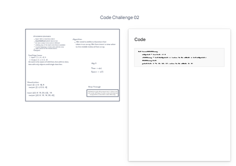

Collaborators
Ashley Taylor
Sarah Glass
Daniel Quinn

# Challenge Title
Code Challenge: Class 02

## Whiteboard Process

## Approach & Efficiency
Taking the array and moving a new integer to the center of the arrray.

## Solution
Taking numbers like [4, 3, 2, 1], 5 and then adding 5 to the center
